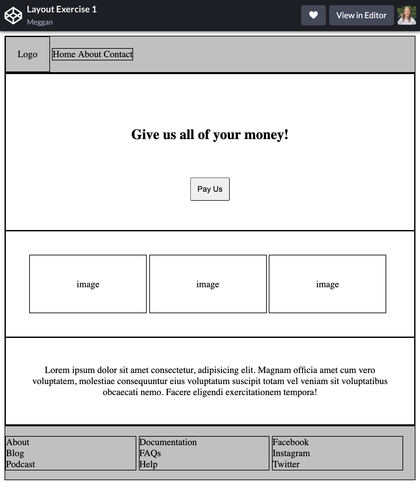

# Layout Exercises
These are some basic wireframe examples to help you improve your layout skills.

## The Task
Take a look at the wireframes below. For each wireframe, use HTML & CSS to try to recreate these layouts.

Example solutions are provided, but remember that HTML & CSS are subjective! There is not absolute perfect answer, and your approach may differ from others'.

> Tip: add borders to elements to get a better sense of how they fit on the page. You could even use the universal selector (*) to give everything a border!

### Exercise One:
Possible solution code: https://codepen.io/megganeturner/pen/yLbxYyo   

### Exercise Two:
Possible solution code: https://codepen.io/megganeturner/pen/mdmGery   

